## Задание Admin panel
 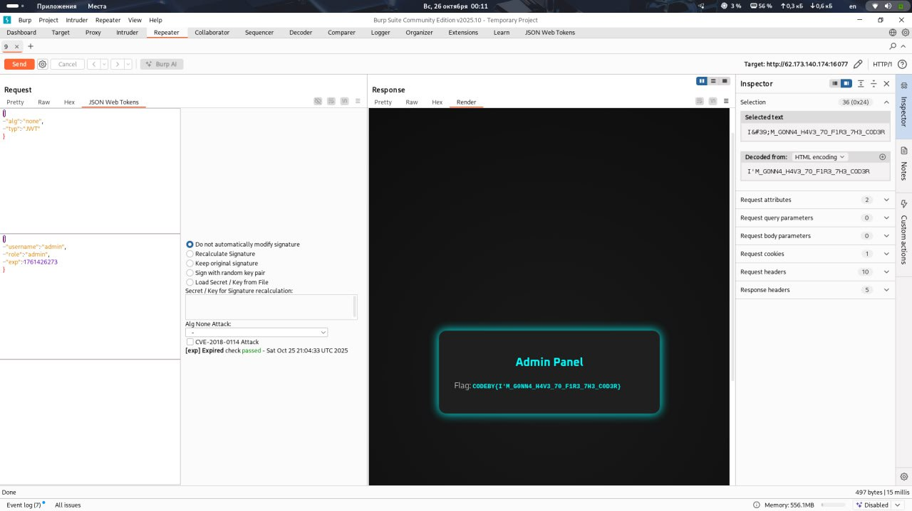
 ### Выполнение:
 1. Перехватывем с помощью burp запрос
   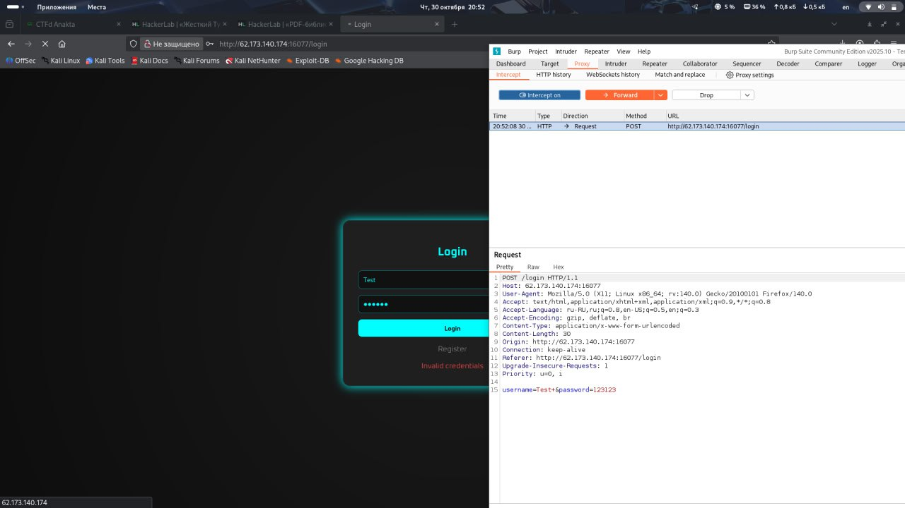
 2. Устанавливаем расширение 
    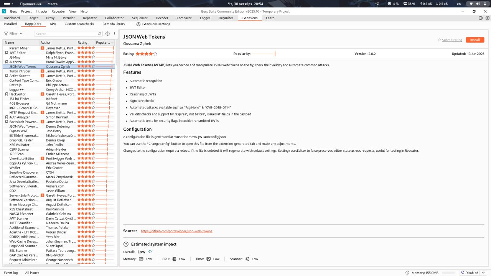
 3. Меняем
    
    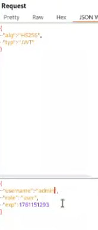
 ## Задание PDF-библиотека
S
### Выполнение:
1. С помощью curl пробиваем 
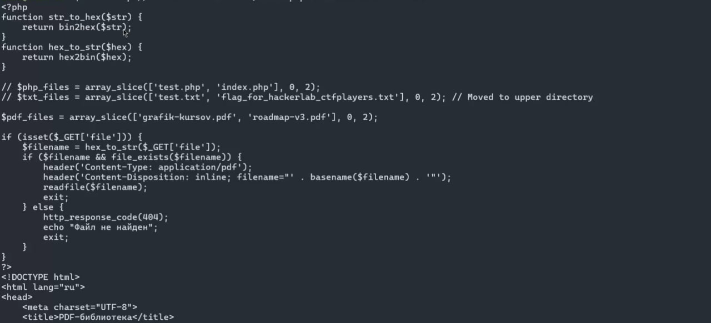
2. Далее строчку с флагом вставляем в декодер
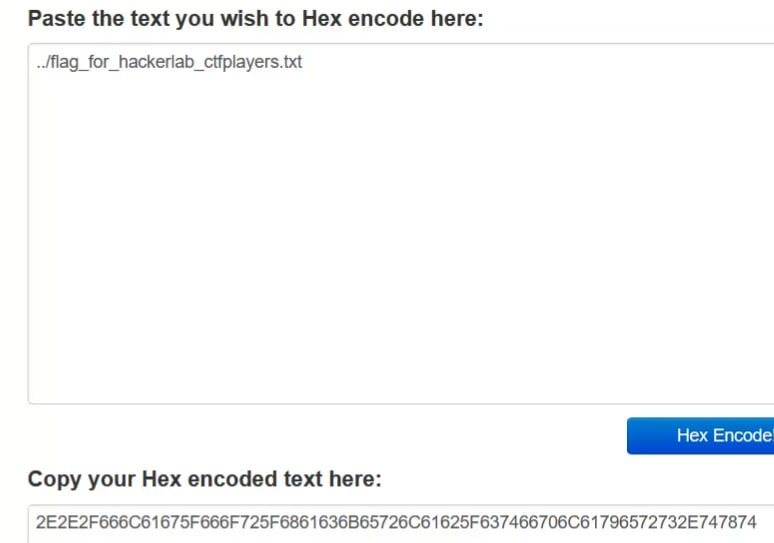
3. Далее пробиваем curl уже с замной 
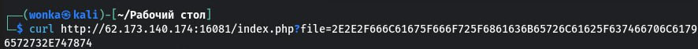
 ## Странный файл Вариант 1
 
### Выполнение
1. По сигнатуре определяем тип rar файла

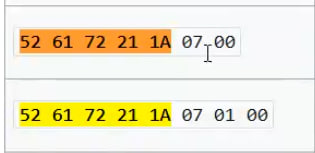

2. Открываем файл с помощью pychaos.io
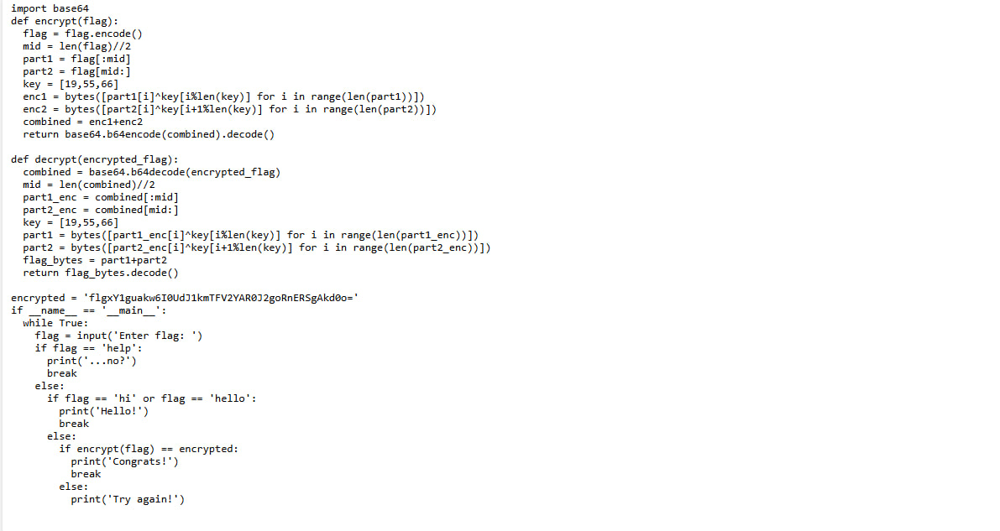

3. Получаем python файл. Открываем его и чуть меняем код. 
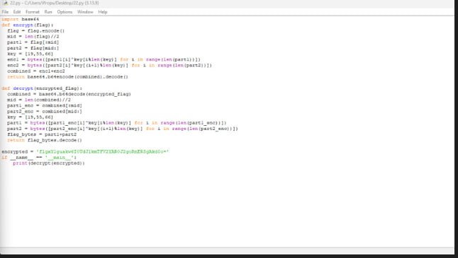
 ## Node.js moment
 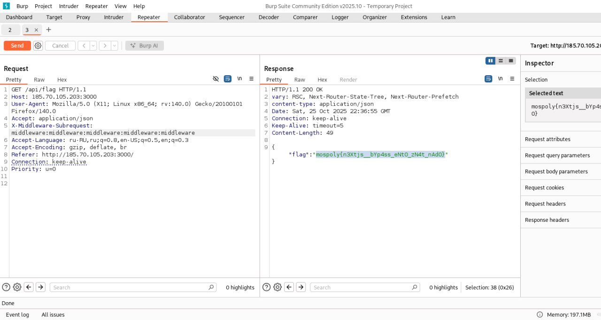
 ### Выполнение
1. Также с помощью burp перехватыем запроc.
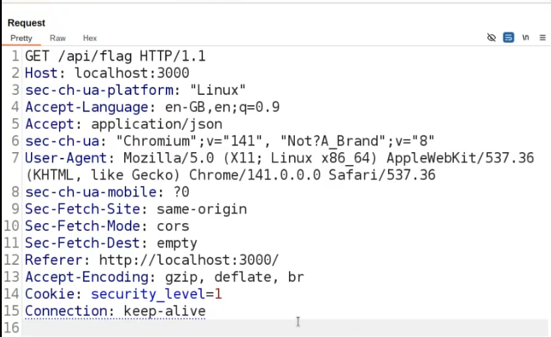
1. Вставляем строчку
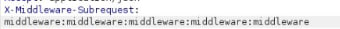 
 ## Задание Binary Reverse
 ### Выполнение 
 1. Получаем ключ и спомощью кода с помощью XOR расшифровываем 
 ### Ключ

 ### Код
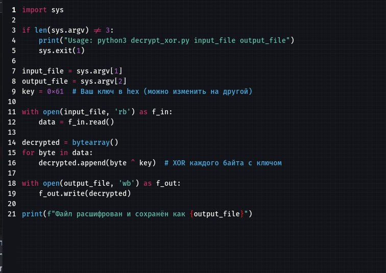
### Флаг
