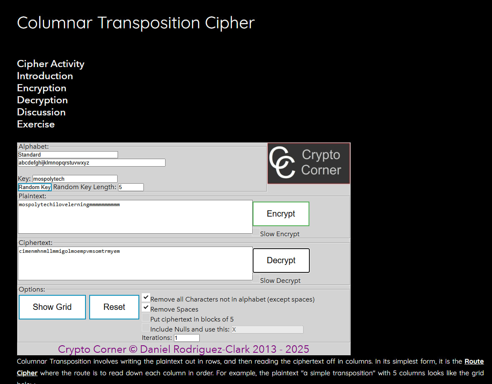
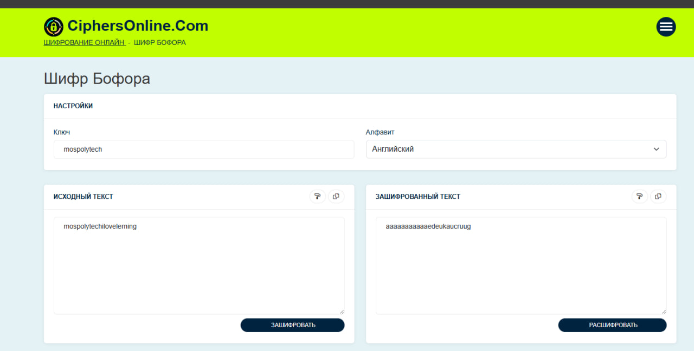
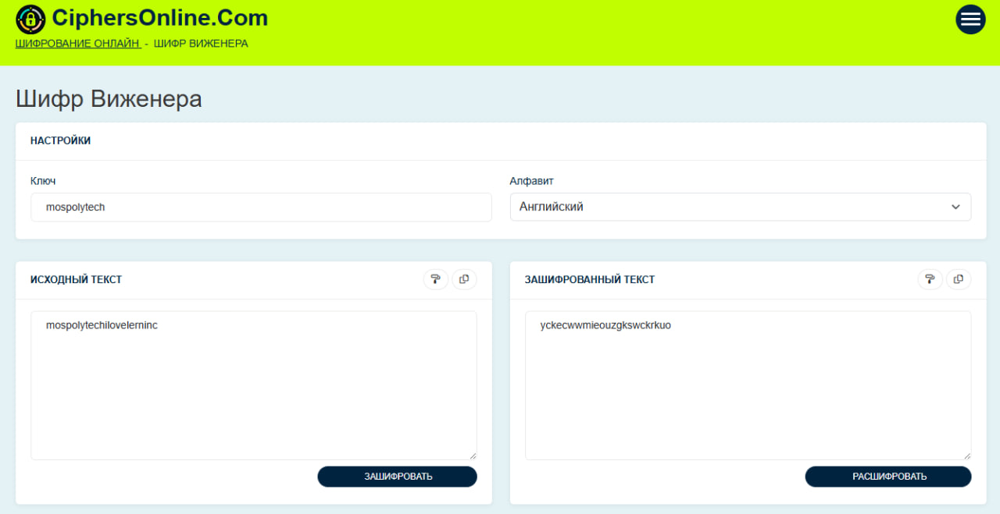

# Криптография
В данном задание надо было найти методы шифрования для каждой фразы. 

1.cimenmhnmllmmigolmoempvmsomtrmyem. Шифр столбцовой перестановки

2. aaaaaaaaaaaedeukaucruug. Шифр Бофора

3. yckecwwmieouzgkswckrkuoю. Шифр Виженера 
